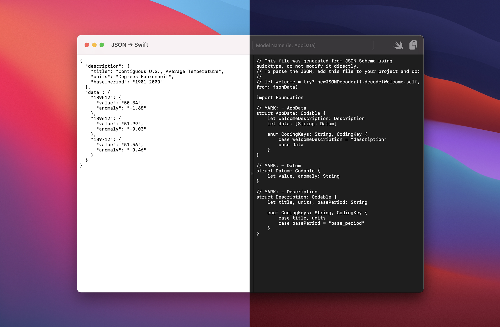

# JSON → Swift

Uses [WKTypeScript](https://github.com/inter-ops/WKTypeScript) to interact with QuickType's [Parser](https://app.quicktype.io/) and generate a Swift model implementation of the input JSON.

